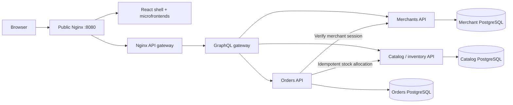

# Base Grid

A merchant inventory storefront built with React microfrontends, GraphQL/FastAPI microservices, PostgreSQL, and Nginx. Merchants register a business and delivery pin, browse inventory, and place persistent orders using simulated payments.

## Start the complete app

```bash
cd ~/Documents/base_shard
sudo docker compose up --build -d
```

Open **http://localhost:8080**. Omit `sudo` if your user has Docker access. The existing command from `frontend/` also starts the complete stack. Compose uses the existing `base-grid-frontend` project name so the frontend containers are upgraded in place.

If another app owns port 8080, choose a free port:

```bash
sudo env FRONTEND_PORT=8081 docker compose up --build -d
```

```bash
sudo docker compose ps
sudo docker compose logs -f orders-api catalog-api merchants-api
sudo docker compose down
```

Database volumes survive rebuilds and `down`. **Do not add `-v` unless you intend to delete merchant profiles, orders, and inventory.** PostgreSQL 18 is used with its data volume mounted at `/var/lib/postgresql`.

## Services

| Service | Responsibility | Database |
| --- | --- | --- |
| `merchants-api` | Business/contact details, OSM coordinates, browser session | `merchants-db` |
| `catalog-api` | Products, prices, stock, quotes, atomic allocation | `catalog-db` |
| `orders-api` | Merchant-owned orders, simulated payment outcome, retry/recovery | `orders-db` |
| `graphql-gateway` | Composes typed merchant, catalog and order GraphQL operations | — |
| `api-gateway` | Nginx routes `/graphql` to gateway replicas | — |
| `gateway` | Public Nginx serves shell routes, microfrontends, and proxies `/graphql` | — |
| `shell`, `signup`, `orders`, `checkout` | Independently built React microfrontends served by Nginx | — |

Each backend API has its own Dockerfile, application code, SQL migrations, and PostgreSQL container/volume. Each database sits on a private service-specific network. Only the public gateway publishes a host port. Services communicate over HTTP and never query another service's database.



## Ordering behavior

1. Signup creates a persistent merchant and a random bearer token. The database stores the token hash; the browser stores the token and a profile cache. Existing frontend-only profiles must be saved once to register with the API.
2. Products and available stock come from catalog. Basket quantities remain in browser storage. Checkout requests a fresh server-calculated quote.
3. Orders verifies the merchant session, persists an order intent, and simulates the requested payment outcome. Declines do not allocate inventory.
4. For successful simulated payment, catalog locks the requested product rows in a consistent order, verifies current stock and the quoted total, and atomically deducts stock while recording an allocation keyed by order ID.
5. Orders persists the confirmed summary. If the API response is lost, the browser reuses the same idempotency key. If a service crashes after allocation, the pending-order worker retries the same allocation and finishes confirmation without another deduction. Timeouts remain pending rather than being treated as definite failures.
6. The browser shows confirmation and server-backed recent orders. Prices and delivery totals in a confirmed order are immutable snapshots. Delivery remains simulated; no dispatch integration exists.

Amounts use integer Kenyan shillings. Delivery is KES 350, waived at KES 15,000. Catalog seeds eight products on first startup and **never resets stock on restart**. There is no replenishment/admin UI yet.

## Configuration and development

Local-only defaults work without an environment file. To override credentials and the internal API key, copy `.env.example` to `.env` at the repository root and run Compose from the root. Database passwords must be URL-safe because they form part of the service connection URLs. Changing a password variable does not change credentials inside an existing PostgreSQL volume; rotate the database credentials as well.

For Vite with containerized APIs:

```bash
sudo docker compose -p base-grid-api-dev -f backend/compose.yaml -f backend/compose.dev.yaml up --build -d
cd frontend
npm ci
API_PROXY_TARGET=http://127.0.0.1:8088 npm run dev
```

Open http://localhost:5173. `npm run build` and `API_PROXY_TARGET=http://127.0.0.1:8088 npm run preview` preview production bundles at port 4173. The API-only dev stack uses a separate Compose project and separate database volumes.

## Tests

```bash
cd frontend
npm ci
npm test
npm run build
npx playwright install chromium
BASE_URL=http://localhost:8080 npm run test:e2e
```

```bash
cd backend
python3 -m venv .venv
.venv/bin/pip install -r requirements-dev.txt
.venv/bin/pytest -q
.venv/bin/ruff check .
```

API integration tests consume sample stock, including exhausting one product to test concurrent buyers. Run them against a **disposable** stack, not your working inventory:

```bash
# From the repository root, use a separate project/port and fresh volumes.
sudo env FRONTEND_PORT=18080 docker compose -p base-grid-tests up --build -d
cd backend
TEST_BASE_URL=http://localhost:18080 .venv/bin/pytest -q
```

Unit tests run without services; API tests skip unless `TEST_BASE_URL` is supplied. The optional recovery test also requires `TEST_ORDERS_DATABASE_URL`, `TEST_CATALOG_URL`, and `TEST_SERVICE_KEY` pointing to disposable service resources. It reproduces an allocation committed before order confirmation and verifies recovery without a second stock deduction.

Validated locally with PostgreSQL 18 and Nginx: merchant/profile persistence and access boundaries, quotes, invalid quantities, payment declines, concurrent duplicate submissions, overselling prevention, interrupted-request recovery, and browser checkout. Docker Compose configuration is validated; Docker image builds/startup still require host daemon access.

## Current scope

Payments are simulated M-Pesa/card outcomes; no funds are charged. Delivery is not dispatched. This is a local development foundation: it has bearer-session isolation, but no password/OTP login, session recovery or revocation, production TLS, replenishment, or real payment-provider integration. Protect tokens as credentials. Shared deployments need proper authentication and secret management; the supplied credentials and internal service key are local defaults.

See [backend API details](backend/README.md) and [frontend architecture](frontend/README.md).

## Load testing and observability

The [Kenya performance lab](load/README.md) provides 100,000 synthetic merchants across 47 counties, distributed Locust workloads, OpenTelemetry traces/metrics, Prometheus, Tempo, and a provisioned Grafana dashboard. It runs as the isolated `base-grid-load` Compose project and includes repeatable API-replica experiments.
